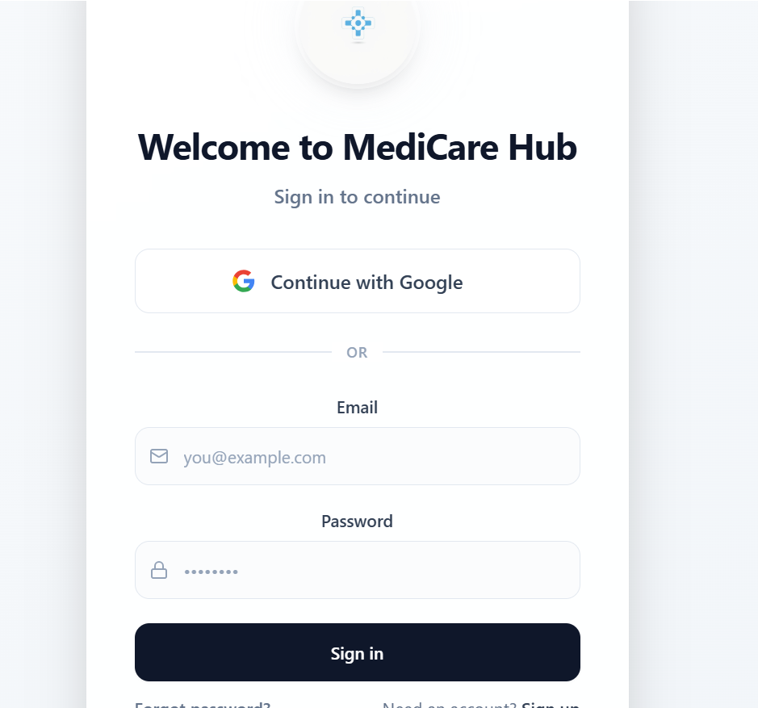
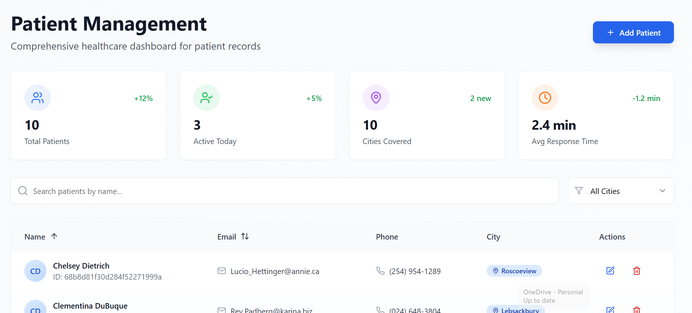
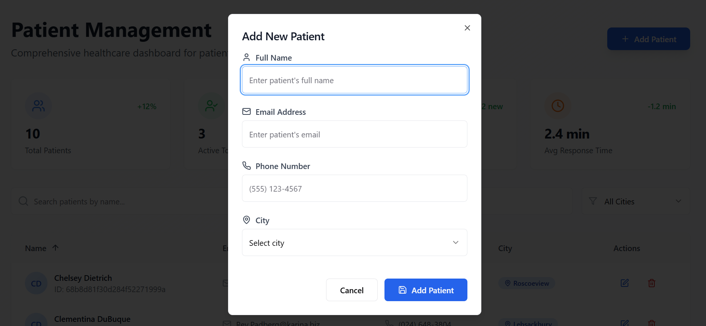

# MediCare Hub - Patient Management Dashboard

[Live Demo](https://medi-care-hub-851f7dea.base44.app)

## Description

MediCare Hub is a **Patient Management Dashboard** built with **React** and **TailwindCSS**. It helps healthcare providers manage patient data efficiently:

* Add, edit, and delete patient records.
* Search and filter patients by name or city.
* Sort patients by name or email.
* Paginate large patient lists for easy navigation.
* View key statistics like total patients, active today, cities covered, and average response time.
* Receive toast notifications for actions like adding, updating, or deleting patients.

The dashboard uses simulated API data and can easily integrate with a real backend.

## Features

* Responsive UI with **Framer Motion** animations.
* Dynamic search and city filter.
* Sorting and pagination.
* Reusable components: `PatientTable`, `PatientForm`, `SearchBar`, `Pagination`, `ToastContainer`.
* Form validation for patient input fields.
* Toast notifications for success, error, info, and warning.

## Tech Stack

* **Frontend:** React, TailwindCSS, Framer Motion
* **Icons:** Lucide React
* **State Management:** React Hooks (useState, useEffect, useMemo, useCallback)

## Screenshots

**Sign In Page**


**Dashboard Overview**


**Add Patient Data**


## Live Demo

Check out the working dashboard here: [https://medi-care-hub-851f7dea.base44.app](https://medi-care-hub-851f7dea.base44.app)

## Installation

1. Clone the repository:

```bash
git clone https://github.com/yourusername/medi-care-hub.git
cd medi-care-hub
```

2. Install dependencies:

```bash
npm install
```

3. Start the development server:

```bash
npm start
```

The app will run on `http://localhost:3000`.
